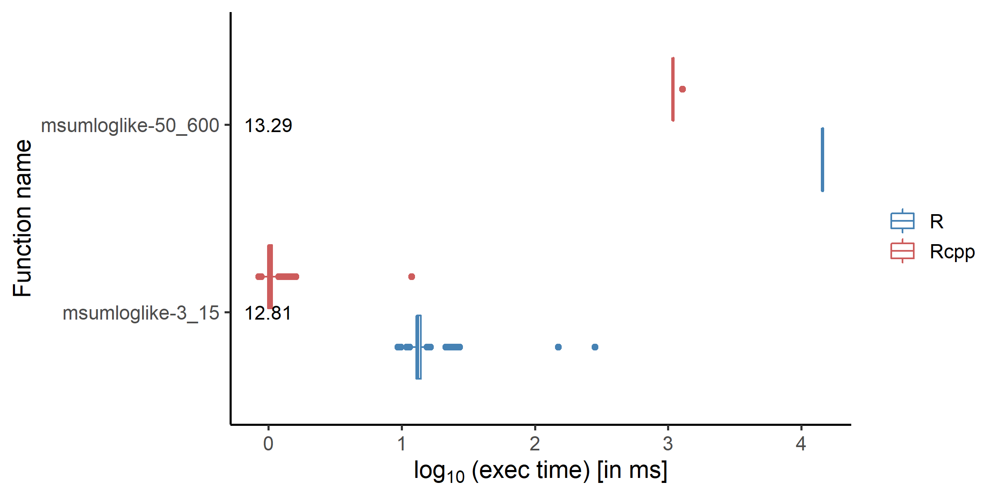
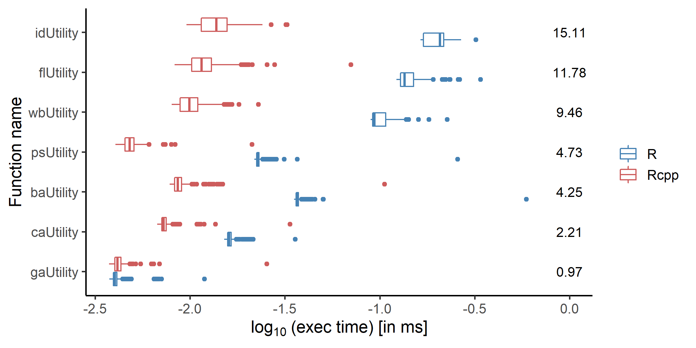
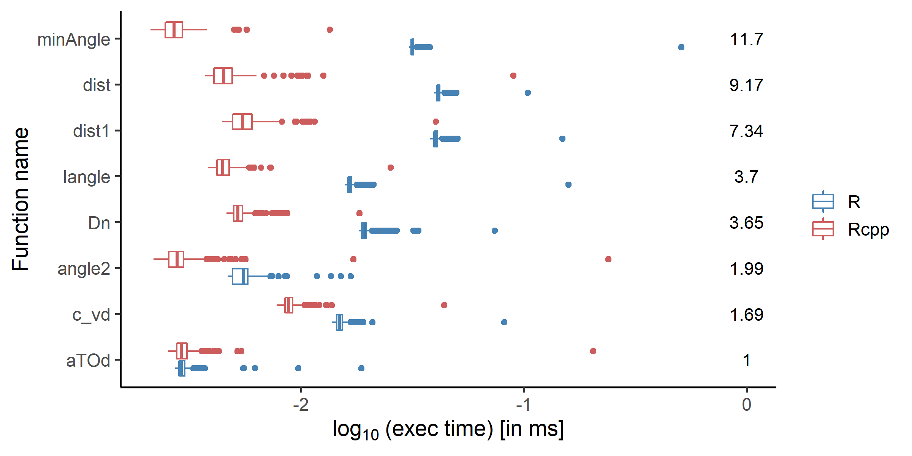
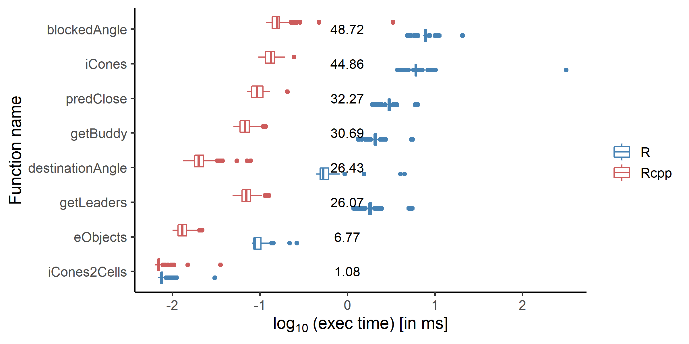

# Benchmarking the m4ma Package Against predped

Malte Lüken and Eva Viviani

07-11-2022

## Goal
To see how reimplementing functionalities of the predped code base (see `../predped/`) improves their performance, we benchmark the original implementations against the ones reimplemented in the m4ma package. We focus on the speed of the code as this is the limiting factor for running simulations of the Predictive Pedestrian model and estimating its parameters.

## Procedure
Based on code profiles (see `../profile/` directory), we identified functions that require the most time to execute during the simulation and estimation. We reimplemented and optimized these functions in C++ and create R bindings for them using the [Rcpp](https://www.rcpp.org/) package. We combined the reimplemented functions into the R package [m4ma](https://github.com/m4ma/m4ma).

We reimplemented and optimized functions from the following modules of the original code base:

- `pp_block.R` -> 'block' (only three slow functions)
- `pp_estimation.R` -> 'likelihood' (only functions related to the likelihood estimation)
- `pp_geometry.R` -> 'geometry'
- `pp_see.R` -> 'see'
- `pp_utility.R` -> 'utility' (actual utility functions) and 'utility_extra' (utility helper functions)

### Benchmark Individual Functions
For each individual function that we reimplemented, we compare the execution times of the original vs. the optimized code. We use the R package [microbenchmark](https://cran.r-project.org/web/packages/microbenchmark/index.html) (version: 1.4.9). The package evaluates the code in C and tries to accurately measure the execution time using (sub-millisecond) timing functions provided by modern operating systems (see [help page](https://www.rdocumentation.org/packages/microbenchmark/versions/1.4.9/topics/microbenchmark)). Each function implementation was evaluated 1000 times to produce more robust measurements as the execution is relatively fast (micro- or milliseconds).

To evaluate the functions, we created test objects that were inspired by objects from the original simulation. For the benchmark of the 'utility' functions, we used a very short simulation result (setup: m01, s02) with 3 iterations and a maximum of 3 pedestrians. To evaluate the 'likelihood' function, we used a shorter simulation result (setup: m01, s02) with 15 iterations and max. 3 pedestrians and a long realistic result (same setup) with 600 iterations and max. 50 pedestrians.

We ran the benchmarks on a single core on a single node on the [DAS-6](https://www.cs.vu.nl/das/home.shtml) cluster. To reproduce the measurements on the cluster run the `bench_modules.job` script. To reproduce them locally, set the working directory to `bench/` and run each benchmark script individually. 

All measurements are stored in the `data/` directory. Each CSV file contains three columns:

- expr: Whether R or Rcpp implementations were executed
- time: The execution time (in nanoseconds)
- fun_name: The name of the executed function

### Benchmark Simulation Performance
To see how different reimplementations affect the performance of the entire simulation, we substituted original implementations with optimized ones. We substituted entire modules (i.e., multiple functions) at once to reduce the amount of simulation runs.

First, we looked at the effect on running the simulation for an additional iteration at full capacity. That is, we ran the long simulation (setup: m01, s02) until it was at its max. of 50 pedestrians at 250 iterations. Then, we substituted different modules with the optimized versions and ran the simulation for an additional iteration. We measured the time to finish the additional iteration. This benchmark was run on 50 cores distributed over 4 nodes on DAS-6 to account for parallelization over pedestrians. It can be reproduced on the cluster with the `bench_moveAll.job` script and locally with `bench_moveAll.R`.

Second, we looked at the effect on running the entire long simulation (setup: m01, s02) for 600 iterations with a max. of 50 pedestrians. This imitates pedestrian behavior over 5 minute real time (1 iteration = 0.5 seconds). We measured the time to complete the simulation while substituting different modules with optimized versions. Because running the long simulations is computationally expensive we only looked at 4 substitutions:

- r001: No substitution, only original R code
- r002: 'see' module substituted
- r003: 'see' and 'utility_extra' modules substituted
- r004: 'see', 'utility_extra', and 'geometry' modules substituted
- r005: 'see', 'utility_extra', 'geometry', and 'block' modules substituted

We selected these combinations based on the benchmark of one additional iteration (see previous paragraph). Again, this benchmark was run on 50 cores distributed over 4 nodes on DAS-6. It can be reproduced on the cluster with the `bench_play_escience_m01s02p03r00*.job` scripts and locally with `bench_play_escience_m01s02p03r00*.R`.

All measurements are stored in the `data/` directory. Each CSV file contains three columns:

- labels: The names of the substituted modules
- time: The elapsed time (in seconds)
- ratio: The relative improvement to no substitution

## Results
The figures can be recreated by running the `create_plots.R` script.

### Benchmark Individual Functions
Execution times are displayed in ms on the log10 scale. Because for most figures the function names were long, we decided to display execution time on the x-axis and the names on the y-axis (against the convention). Numbers next to the figure elements indicate the relative improvement between R and Rcpp implementations (median R/median Rcpp execution time).

### Benchmark Simulation Performance
Total elapsed times are displayed in s.

