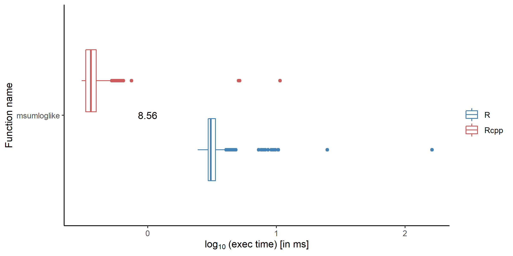
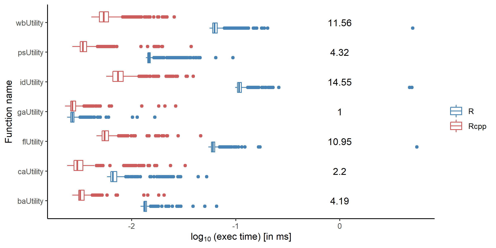
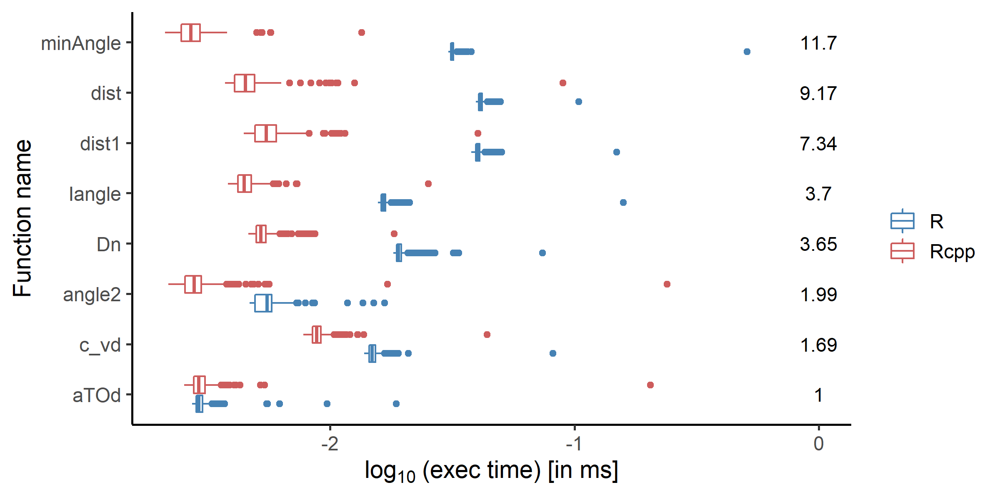
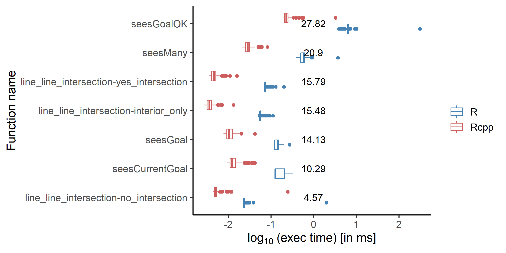
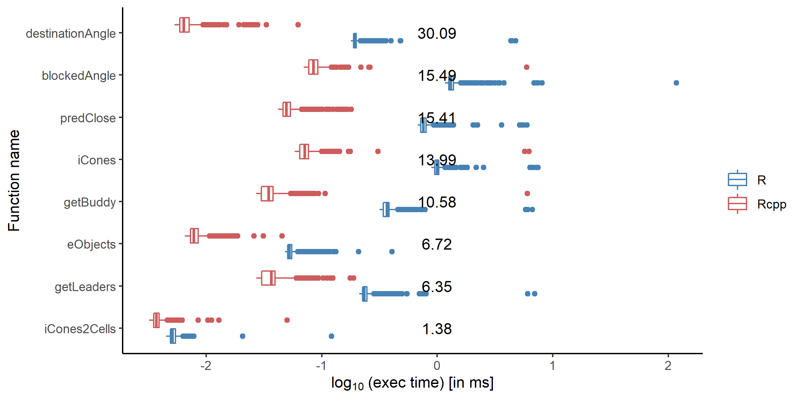

# Benchmarking the M4MA Package against predped

Malte Lüken and Eva Viviani

07-11-2022

## Goal
To see how reimplementing functionalities of the predped code base improves their performance, we benchmark the original implementations against the ones reimplemented in the m4ma package. We focus on the speed of the code as this is the limiting factor for running simulations of the Predictive Pedestrian model and estimating its parameters.

## Procedure
Based on code profiles (see `../profile/` directory), we identified functions that require the most time to execute during the simulation and estimation. We reimplemented and optimized these functions in C++ and create R bindings for them using the [Rcpp](https://www.rcpp.org/) package. We combined the reimplemented functions into the R package [m4ma](https://github.com/m4ma/m4ma).

For the estimation and three different modules that are part of the simulation of the Predictive Pedestrian base, we reimplemented and optimized the original code. Using the R package [microbenchmark](https://cran.r-project.org/web/packages/microbenchmark/index.html) (version: 1.4.9), we compare the execution times of the original vs. the reimplemented code. The package evaluates the code in C and tries to accurately measure the execution time using (sub-millisecond) timing functions provided by modern operating systems (see [help page](https://www.rdocumentation.org/packages/microbenchmark/versions/1.4.9/topics/microbenchmark)). Every function implementation was run and measured 1000 times.

We ran the benchmarks (i.e., the `bench_*.R` scripts) on a single node on the [DAS-6](https://www.cs.vu.nl/das/home.shtml) cluster. To reproduce the measurements on the cluster run the `bench.job` script from the `bench/` directory. To reproduce them locally, set the working directory to `bench/` (`R setwd('bench')`) and run each benchmark script individually. The measurements are stored in the `data/` directory. Once the measurement are there, the figures can be recreated by running the `create_plots.R` script. 

Execution times are displayed in ms on the log10 scale. Because for most figures the function names were long, we decided to display execution time on the x-axis and the names on the y-axis (against the convention). 

## Results
To make the estimation procedure as fast as possible, we reimplemented and optimized the entire procedure.

